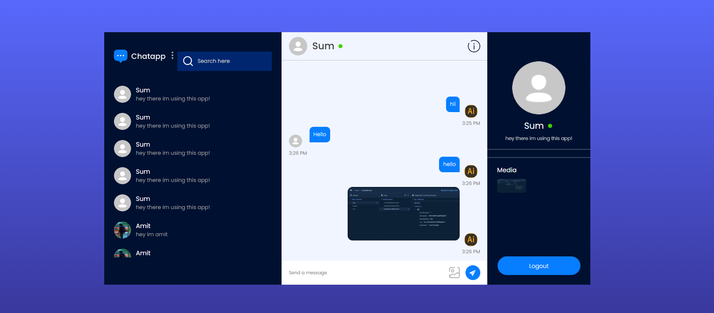

# ChatApp

ChatApp is a real-time web-based chat application built using ReactJS and Firebase. This project serves as my first full-stack project, so there might be some mistakes and bugs. However, everyone is welcome to contribute and help improve the application.

# Screenshots

## Instructions

To use ChatApp, follow these steps:

1. Clone the repository to your local machine.
2. Install the necessary dependencies by running `npm install` in the project directory.
3. Create a Firebase project and obtain the Firebase configuration.
4. Replace the Firebase configuration in the `src/firebase.js` file with your own configuration.
5. Start the development server by running `npm start`.
6. Open your browser and navigate to `http://localhost:3000` to access the ChatApp.

Feel free to explore the codebase, make improvements, and contribute to the project. Your contributions are highly appreciated!
## Features

ChatApp offers the following features:

- Real-time messaging: Chat with other users in real-time, allowing for seamless communication.
- User authentication: Securely register and login to ChatApp using Firebase authentication.
- Online status: See the online status of other users, indicating whether they are currently active.
- Message history: Access the chat history and view previous conversations.
- Emojis and reactions: Express yourself with a wide range of emojis and react to messages with various reactions.
- Notifications: Receive notifications for new messages and mentions.

## Contributing

We welcome contributions from the community to help improve ChatApp. If you have any ideas, bug fixes, or feature requests, please follow these steps:

1. Fork the repository and create a new branch for your contribution.
2. Make your changes and ensure that the code is clean and well-documented.
3. Test your changes thoroughly to avoid introducing new bugs.
4. Submit a pull request, describing the changes you have made and why they are valuable.

Please note that all contributions are subject to review and approval. We appreciate your time and effort in making ChatApp better for everyone.

## License

ChatApp is open-source software licensed under the MIT License. You can find the full license text in the `LICENSE` file.

## Contact

If you have any questions, suggestions, or need assistance with ChatApp, please feel free to reach out to us at amitdey1350@gmail.com. We are here to help and would love to hear from you!
## Frequently Asked Questions

Here are some common questions and answers about ChatApp:

### Q: Can I use ChatApp on mobile devices?

A: Maybe no i didnot made it responsive as its my first full stack project so i request anyone to contribute 

### Q: How secure is ChatApp?

A: ChatApp uses Firebase authentication for user registration and login, which provides a secure authentication mechanism. Additionally, Firebase Realtime Database ensures that messages are transmitted securely over HTTPS.

### Q: Can I customize the appearance of ChatApp?

A: Yes, you can customize the appearance of ChatApp by modifying the CSS files in the project. Feel free to experiment with different styles and layouts to suit your preferences.

### Q: How can I add additional features to ChatApp?

A: ChatApp is built using ReactJS, which makes it easy to extend and add new features. You can explore the codebase and add new components, implement new functionalities, or integrate third-party libraries to enhance the application.

### Q: Are there any known issues or limitations?

A: While we strive to provide a bug-free experience, there might be some known issues or limitations in ChatApp. You can check the project's issue tracker on GitHub to see if any issues have been reported. If you encounter any problems, please feel free to report them so that we can address them promptly.

### Q: How can I contribute to the documentation?

A: If you would like to contribute to the documentation of ChatApp, you can submit a pull request with your proposed changes. We appreciate any improvements or clarifications you can provide to make the documentation more helpful for other users.

### Q: Can I integrate ChatApp with other services or APIs?

A: Yes, you can integrate ChatApp with other services or APIs to extend its functionality. For example, you can integrate a third-party authentication service or add support for file sharing by integrating a cloud storage service. The possibilities are endless, so feel free to explore and experiment!

## Roadmap

Here are some planned features and improvements for future versions of ChatApp:

- Private messaging: Implement the ability to have private conversations with specific users.
- Message search: Add a search functionality to easily find specific messages or conversations.
- User profiles: Allow users to create profiles and customize their display names and avatars.
- Message reactions: Expand the range of reactions that users can use to respond to messages.
- Dark mode: Implement a dark mode option for users who prefer a darker color scheme.

Please note that the roadmap is subject to change based on user feedback and priorities. We are always open to suggestions and ideas from the community.

## Acknowledgements

We would like to express our gratitude to the following individuals and projects for their contributions to ChatApp:

- The ReactJS team for creating an amazing JavaScript library for building user interfaces.
- Firebase for providing a powerful and scalable backend infrastructure for ChatApp.
- The open-source community for their continuous support and valuable feedback.

Without their contributions, ChatApp would not have been possible. Thank you!
